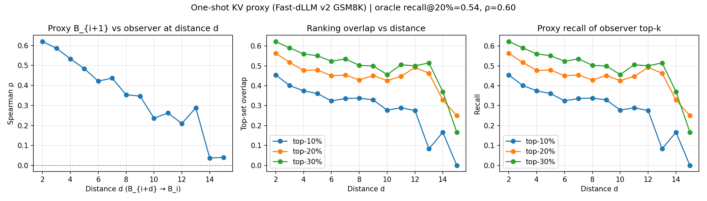

# One-shot KV allocation — proxy test

**Дата прогона:** 2026-08-08
**Модель:** Fast-dLLM v2 7B (`Efficient-Large-Model/Fast_dLLM_v2_7B`)
**Задача:** GSM8K, chat template, num_fewshot=0

---

## 1. Гипотеза

Можно ли **один раз** после завершения блока B_i и появления B_{i+1} оценить важность токенов B_i (для KV precision / eviction) по attention на **первом denoising step** блока B_{i+1} — и больше не пересчитывать?

Формально: ranking токенов B_i, полученный из saliency (B_{i+1} → B_i), должен хорошо предсказывать их важность для **всех более поздних** блоков B_{i+2}, B_{i+3}, …

---

## 2. Метод

### 2.1 Генерация и захват attention

Для каждой генерации Fast-dLLM v2:

1. Блок B_j проходит inner denoising loop (sub-blocks по 8 токена, threshold=1.0).
2. На **inner_step = 0** (первый forward замаскированного B_j) захватывается attention matrix.
3. Для каждого завершённого B_i (i < j) считается **token-level saliency**:

   sal(t) = Σ_{q ∈ B_j} Σ_{layers} mean_heads attn[q, t]

   — сумма attention от всех query-позиций текущего блока к key-позиции t в B_i.

4. Агрегация: **mean over all 28 layers**, head-mean внутри слоя.

### 2.2 Определения ranking

| Обозначение | Описание |
|-------------|----------|
| **Proxy** | Saliency B_i с observer block B_{i+1} (distance d=1) |
| **Observer(d)** | Saliency B_i с B_{i+d} на step 0 |
| **Strict oracle** | Mean saliency по B_{i+2}, B_{i+3}, … (без B_{i+1}) |
| **All-future oracle** | Mean по всем будущим блокам, включая B_{i+1} |

### 2.3 Метрики

- **Spearman ρ** — rank correlation между proxy и observer/oracle.
- **Top-p% overlap** — |top-p%(proxy) ∩ top-p%(observer)| / p·|block|.
- **Recall@p%** — доля токенов из top-p% oracle, попавших в top-p% proxy.

Главный график: **качество proxy (фиксированный B_{i+1}) vs distance d** до observer block.

---

## 3. Setup

### 3.1 Модель и задача

| | |
|---|---|
| Модель | Fast-dLLM v2 7B (`Efficient-Large-Model/Fast_dLLM_v2_7B`) |
| Задача | gsm8k |
| Prompt | chat template (Qwen2.5 instruct), num_fewshot=0 |
| Decoding | confidence threshold + always-unmask argmax |

### 3.2 Блочная структура генерации

```
Prompt | B_0 (bd_size tok) | B_1 (bd_size tok) | B_2 | …
         └─ num_small_blocks sub-blocks по small_block_size
```

| Параметр | Значение | Пояснение |
|----------|----------|-----------|
| **bd_size** | **32** | размер generation block B_i (токенов) |
| **small_block_size** | **8** | sub-block внутри denoising loop |
| sub-blocks / block | 4 | bd_size ÷ small_block_size |
| max_new_tokens | 512 | ~16 gen blocks max |
| threshold | 1.0 | unmask если confidence > threshold |

Официальный GSM8K setup Fast-dLLM v2: `bd_size=32`, `small_block_size=8`, `threshold=1.0`.

### 3.3 Момент захвата attention (proxy)

| | |
|---|---|
| **Когда** | `inner_step = 0` observer block B_j — **первый forward** блока |
| **Состояние B_j** | все **bd_size** позиций ещё `[MASK]` (до первого unmask) |
| **Forward** | на **весь блок** `x_t[:, -bd_size:]`, не на sub-block slice |
| **Query** | все **bd_size** query-позиций B_j |
| **Key** | prefix KV + текущий блок; для B_i — key-индексы `[gen_start_abs, gen_end_abs)` |
| **Proxy** | saliency B_i с observer **B_{i+1}** (distance d=1) на его step 0 |

Sub-blocks (по 8 tok) влияют только на **порядок unmask** после step 0; на saliency proxy — нет.

### 3.4 Агрегация attention → saliency

```
sal(t) = Σ_{q ∈ B_j, step=0} mean_{layers} mean_{heads} attn[q, t]
```

| | |
|---|---|
| Layers | all (28 layers, mean) |
| Heads | head-mean внутри каждого слоя |
| Capture | SDPA hook, manual softmax (не flash weights) |

### 3.5 Параметры прогона

| Параметр | Значение |
|----------|----------|
| n samples | 16 |
| seed | 1234 |
| elapsed | 269s |

### 3.6 Статистика датасета

- Source blocks (уникальных B_i): **161**
- Cross-block attention records: **948**
- Пар с strict oracle (≥2 будущих блока): **145**

---

## 4. Результаты

### 4.1 Proxy (B_{i+1}) vs strict-future oracle

Strict oracle = «истинная» distant-future важность без учёта самого proxy-блока.

| Metric | Mean | Комментарий |
|--------|------|-------------|
| Spearman ρ (d≥2) | **0.601** | умеренная rank correlation |
| Spearman ρ (all future) | 0.878 | завышен: B_{i+1} ∈ oracle |
| Top-10% overlap | 0.430 | ~3 из 7 top-токенов совпадают |
| Top-20% overlap | **0.542** | ~3.5 из 6.4 top-токенов |
| Top-30% overlap | 0.606 | |
| Recall@10% oracle | 0.430 | |
| Recall@20% oracle | **0.542** | **54%** important tokens recovered |
| Recall@30% oracle | 0.606 | |

### 4.2 Proxy vs observer на расстоянии d

Фиксированный proxy (B_{i+1}); по оси X — насколько далеко observer block.
d=1 — тривиально (proxy vs itself). Интересны d ≥ 2.

| d | n | Spearman | Ovlp@10% | Ovlp@20% | Ovlp@30% | Recall@20% |
|---|---|----------|----------|----------|----------|------------|
| 1 | 161 | 1.000 | 1.000 | 1.000 | 1.000 | — |
| 2 | 145 | 0.620 | 0.455 | 0.563 | 0.622 | 0.563 |
| 3 | 129 | 0.586 | 0.401 | 0.517 | 0.590 | 0.517 |
| 4 | 113 | 0.533 | 0.375 | 0.477 | 0.560 | 0.477 |
| 5 | 97 | 0.484 | 0.361 | 0.479 | 0.551 | 0.479 |
| 6 | 81 | 0.422 | 0.324 | 0.450 | 0.523 | 0.450 |
| 7 | 65 | 0.437 | 0.336 | 0.454 | 0.535 | 0.454 |
| 8 | 50 | 0.354 | 0.338 | 0.429 | 0.502 | 0.429 |
| 9 | 37 | 0.347 | 0.329 | 0.451 | 0.499 | 0.451 |
| 10 | 27 | 0.237 | 0.278 | 0.426 | 0.456 | 0.426 |
| 11 | 19 | 0.262 | 0.289 | 0.447 | 0.506 | 0.447 |
| 12 | 13 | 0.210 | 0.276 | 0.492 | 0.500 | 0.492 |
| 13 | 7 | 0.288 | 0.083 | 0.463 | 0.515 | 0.463 |
| 14 | 3 | 0.037 | 0.167 | 0.329 | 0.370 | 0.329 |
| 15 | 1 | 0.040 | 0.000 | 0.250 | 0.167 | 0.250 |

**Зоны distance:**

| Зона | d | Spearman (тип.) | Recall@20% (тип.) |
|------|---|-----------------|------------------|
| Краткий горизонт | 2–3 | 0.59–0.62 | 0.52–0.56 |
| Средний | 4–7 | 0.42–0.53 | 0.45–0.48 |
| Длинный | 8–10 | 0.24–0.35 | 0.43–0.45 |

При d≥10 n падает (<30 пар) — хвост таблицы статистически шумный.

### 4.3 Главный график



Левый panel: Spearman proxy vs observer — **монотонный спад** (~0.62 → ~0.24 за 8–10 блоков).
Средний: top-set overlap — **плато ~0.43–0.56** до d≈9, затем просадка top-10%.
Правый: recall@k — proxy сохраняет ~половину important tokens даже на distance 8–10.

---

## 5. Интерпретация

### 5.1 Что работает

- **B_{i+1} несёт реальный сигнал** о том, какие токены B_i понадобятся дальше: recall@20% = 54% vs strict oracle — лучше random (~20%).
- На **2–4 блока вперёд** (64–128 gen tokens) proxy остаётся практичным: ρ ≈ 0.48–0.62.
- **Top-set стабильнее ranking:** overlap@20% ~0.43–0.56 даже при d=8–9, когда Spearman уже ~0.35 — для KV eviction важнее «кого оставить», а не точный порядок.

### 5.2 Что не работает

- **Полный one-shot без refresh** не покрывает distant future: ~46% important tokens в top-20% oracle **пропускаются** proxy.
- **Rank order drift:** Spearman падает ниже 0.4 уже к d=6–8; relative priority между «важными» токенами меняется.
- ρ(all future)=0.88 vs ρ(strict)=0.60 — B_{i+1} доминирует; distant blocks **перераспределяют** attention mass иначе, чем предсказывает proxy.

### 5.3 Связь с KV allocation

Если политика eviction = «оставить top-k% по saliency»:

| Стратегия | Ожидаемое поведение |
|-----------|---------------------|
| One-shot после B_{i+1}, k=20% | ~54% truly-important tokens сохранены; подходит как **cold start** |
| One-shot, длинная генерация (>8 blocks) | ~40–45% recall; **нужен refresh** |
| Refresh каждые 2–3 блока | Компромисс cost/quality; d=2–3 ρ ещё >0.55 |
| Oracle (full re-forward) | Upper bound; дорого по compute |

---

## 6. Выводы

### Вердикт: **PARTIAL GO** — one-shot allocation работает как начальная эвристика, но не покрывает distant future.

- Proxy (B_{i+1}) vs strict oracle (B_{i+2}…): Spearman ρ = **0.60**, recall@20% = **54%** — из top-20% «истинно важных» токенов proxy угадывает примерно **54%**.
- На **кратком горизонте** (d=2, ближайший блок после proxy): ρ = 0.62, overlap@20% = 56% — ranking ещё близок к proxy.
- На **среднем горизонте** (d=8, ~256 токенов вперёд): ρ падает до **0.35**, но overlap@20% остаётся **43%** — top-set частично сохраняется, хотя порядок внутри множества уже расходится.
- На **длинном горизонте** (d=10): ρ ≈ **0.24** — ранжирование существенно меняется; top-10% overlap падает до 28%.
- Spearman **монотонно деградирует** с distance (1.0 → ~0.24 к d=10), тогда как recall@20% **плато ~0.43–0.56** до d≈9 — proxy сохраняет половину важных токенов, но не их точный порядок.
- ρ(all future) = 0.88 >> ρ(strict) = 0.60: B_{i+1} доминирует в oracle; distant blocks добавляют шум, который proxy не предсказывает.

### Практические рекомендации

1. **Использовать B_{i+1} attention как initial precision map** для B_i сразу после commit — это дешёво (один forward уже выполнен) и даёт ~54% recall important tokens.
2. **Не полагаться на one-shot на всю генерацию** — планировать re-allocation каждые 2–4 блока (64–128 tokens) или при падении confidence / смене topic.
3. **Для eviction достаточно top-set, не exact rank** — overlap стабильнее Spearman; top-20–30% cutoff разумен.
4. **Следующий эксперимент:** связать saliency-based eviction с quality metric (logit drift, changed_vs_first из volatility traces) — проверить, при каком recall@k деградация pred становится значимой.

---

## 7. Ограничения

- **n=16** GSM8K samples — предварительный прогон; CI широкие, особенно для d≥10.
- **512 max_new_tokens** — ~10–14 gen blocks; длинные траекторies (2048 tok) не покрыты.
- Attention capture через SDPA hook (manual softmax) — может отличаться от flash path.
- **All layers equal weight** — не оптимизировано для KV; поздние слои могут быть информативнее.
- Saliency = sum over all query positions B_j — не различает sub-block structure.
- Block boundaries зависят от prompt alignment; используются фактические gen_start_abs из trace.

---

## 8. Файлы

| Файл | Содержание |
|------|------------|
| `attn_traces.jsonl` | сырые saliency records + generation traces |
| `kv_proxy_summary.json` | агрегированные метрики |
| `kv_proxy_distance_curve.png` | главный график |
| `meta.json` | конфиг прогона |

**Перезапуск:** `bash run_kv_proxy.sh 16 checkpoints/kv_proxy_n16`