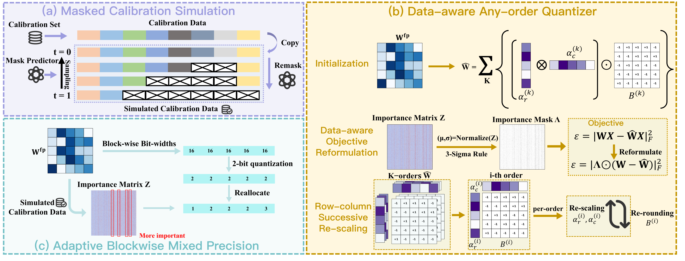
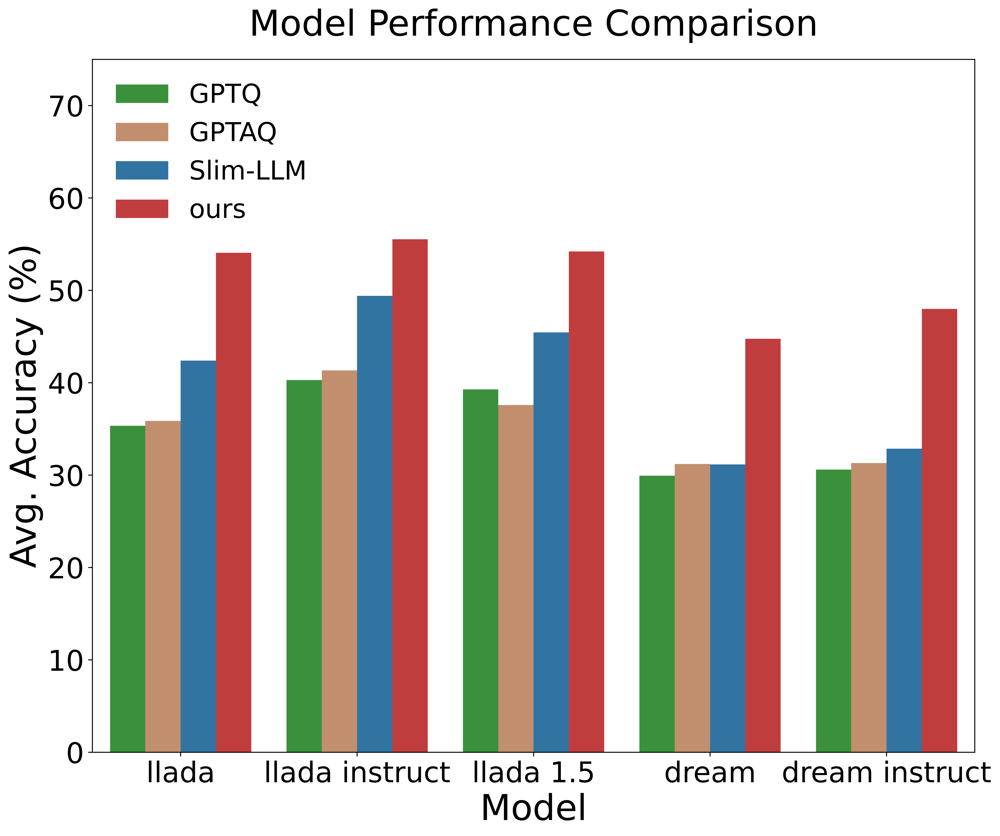
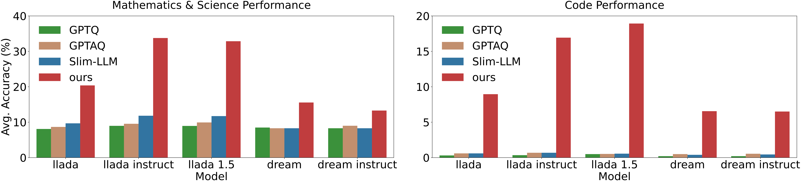

# Quant-dLLM: Post-Training Extreme Low-Bit Quantization for Diffusion Large Language Models

<p align="center">
  <a href="https://www.arxiv.org/abs/2510.03274">
    
  </a>
  <a href="https://github.com/ZTA2785/Quant-dLLM">
    
  </a>
</p>

[Tianao Zhang](https://zta20040910.github.io/), [Zhiteng Li](https://zhitengli.github.io), [Xianglong Yan](https://xianglongyan.github.io/), [Haotong Qin](https://htqin.github.io/), [Yong Guo](https://www.guoyongcs.com/), and [Yulun Zhang](http://yulunzhang.com/).

[[arXiv](https://arxiv.org/abs/2510.03274)]

#### 🔥🔥🔥 News

- **2025-10-07:** This repo is released.

---

> **Abstract:** Diffusion large language models (dLLMs), which offer bidirectional context and flexible masked-denoising generation, are emerging as a compelling alternative to autoregressive (AR) LLMs. However, like AR LLMs, their model sizes continue to grow, motivating weight compression for deployment. Although post-training quantization (PTQ) is effective for AR LLMs, directly transferring it to dLLMs at 2-bit leads to unsatisfactory performance. To tackle these challenges, we propose Quant-dLLM, an ultra-low-bit PTQ framework tailored to dLLMs. Since masked-denoising activations in dLLMs differ from the fully visible signals assumed by standard PTQ methods, we introduce Masked Calibration Simulation (MCS) to align calibration with the timestep-dependent masking, which yields more reliable calibrations. Moreover, we propose a Data-aware Any-order Quantizer (DAQ) that learns ultra-low-bit weight representations via an optimization algorithm. It performs iterative approximation guided by our simulated calibration data. In addition, under a strict 2-bit budget, we introduce Adaptive Blockwise Mixed Precision (ABMP), a sensitivity-based precision allocation scheme that adaptively assigns bit width across channel groups. When restricted to 2-bit precision, Quant-dLLM consistently achieves higher accuracy than state-of-the-art (SOTA) AR-transfer PTQ methods on dLLMs. The code and models will be available at: https://github.com/ZTA2785/Quant-dLLM



---

## Overview

Quant-dLLM is a training-free, weight-only post-training quantization framework
designed for diffusion language models. It combines:

- **Masked Calibration Simulation (MCS)** to match timestep-dependent
  masked-denoising activations.
- **Data-aware Any-order Quantization (DAQ)** with row-column rescaling.
- **Adaptive Blockwise Mixed Precision (ABMP)** with 1/2/3-bit block
  allocation under a strict 2-bit average budget.

## ⚒️ TODO

- [x] Release the Quant-dLLM quantization pipeline.
- [x] Release reproducible environment and model preparation instructions.
- [x] Release LLaDA and Dream evaluation adapters.

## 🔗 Contents

- [Environment setup](#environment-setup)
- [Model preparation](#model-preparation)
- [Post-training quantization](#post-training-quantization)
- [Evaluation](#evaluation)
- [Results](#-results)
- [Citation](#citation)
- [Acknowledgements](#-acknowledgements)

### Repository layout

```text
.
├── run_arb_llada.py       # LLaDA quantization entry point
├── run_arb_dream.py       # Dream quantization entry point
├── run.sh                 # Unified single-model launcher
├── binary_arb.py          # DAQ / row-column quantization kernels
├── bigptq_arb.py          # Hessian collection and ABMP allocation
├── datautils.py           # Calibration datasets and cache
├── eval_table1.sh         # Single-model evaluation launcher
├── paths.py               # Portable path configuration
└── scripts/               # Optional evaluation repository setup
```

Model weights, datasets, calibration caches, logs, and quantized checkpoints
are deliberately excluded from Git.

## Environment setup

The default 8B-model calibration setting requires an NVIDIA GPU with
approximately 80 GB of memory. Python 3.11 is recommended.

After cloning this repository:

```bash
cd Quant-dLLM
conda env create -f environment.yml
conda activate quant-dllm

# Verify PyTorch and CUDA.
python -c "import torch; print(torch.__version__, torch.cuda.is_available())"
```

If PyTorch must be installed from a CUDA-specific package index, create the
environment manually:

```bash
conda create -n quant-dllm -c conda-forge python=3.11 pip
conda activate quant-dllm
python -m pip install torch
python -m pip install -r requirements.txt
```

Evaluation dependencies are optional:

```bash
python -m pip install -r requirements-eval.txt
```

## Model preparation

Models are stored in `../model` by default:

```bash
hf download GSAI-ML/LLaDA-8B-Base \
  --local-dir ../model/LLaDA-8B-Base
hf download GSAI-ML/LLaDA-8B-Instruct \
  --local-dir ../model/LLaDA-8B-Instruct
hf download GSAI-ML/LLaDA-1.5 \
  --local-dir ../model/LLaDA-1.5
hf download Dream-org/Dream-v0-Base-7B \
  --local-dir ../model/Dream-v0-Base-7B
hf download Dream-org/Dream-v0-Instruct-7B \
  --local-dir ../model/Dream-v0-Instruct-7B
```

The default directories can be changed without editing source files:

```bash
export QUANT_DLLM_MODEL_DIR=/path/to/models
export QUANT_DLLM_DATA_DIR=/path/to/datasets
export QUANT_DLLM_OUTPUT_DIR=/path/to/checkpoints
export QUANT_DLLM_LOG_DIR=/path/to/logs
```


## Post-training quantization

Run one model at a time:

```bash
DEVICE=cuda:0 ./run.sh llada-base
DEVICE=cuda:0 ./run.sh llada-instruct
DEVICE=cuda:0 ./run.sh llada-1.5
DEVICE=cuda:0 ./run.sh dream-base
DEVICE=cuda:0 ./run.sh dream-instruct
```

The paper reproduction defaults are:

- C4 calibration set with 128 samples.
- Sequence length 4096.
- Group and block size 128.
- ABMP ratio 5% for LLaDA and 10% for Dream.

Quantized checkpoints and block-order files are written to `output/` by
default. Logs are written to `log/`.

## Evaluation

Install the evaluation dependencies and prepare pinned upstream LLaDA and Dream
evaluation repositories:

```bash
python -m pip install -r requirements-eval.txt
./scripts/setup_evaluation_repos.sh
```

Evaluate one quantized model:

```bash
# Four zero-shot Table 1 tasks:
# PIQA, ARC-Challenge, ARC-Easy, and HellaSwag
./eval_table1.sh llada-base quant zero_shot 0
./eval_table1.sh dream-base quant zero_shot 0

# Five-shot MMLU and WinoGrande
./eval_table1.sh llada-base quant five_shot 0

# BBH generation
./eval_table1.sh llada-base quant bbh 0
```

## 🔎 Results

<details>
<summary>Our Quant-dLLM yields the best accuracy at equal memory cost on 7 general tasks. (click to expand)</summary>
<p align="center">
  
</p>

</details>

<details>
<summary>Our Quant-dLLM yields the best accuracy at equal memory cost on mathematical & scientific reasoning, and code generation datasets. (click to expand)</summary>

<p align="center">
  
</p>

</details>

## Citation

If you find the code helpful in your research or work, please cite the following paper.

```bibtex
@article{zhang2025quantdllm,
      title={Quant-dLLM: Post-Training Extreme Low-Bit Quantization for Diffusion Large Language Models}, 
      author={Tianao Zhang and Zhiteng Li and Xianglong Yan and Haotong Qin and Yong Guo and Yulun Zhang},
      year={2025},
      eprint={2510.03274},
      archivePrefix={arXiv},
      url={https://arxiv.org/abs/2510.03274}, 
}
```

The implementation is derived from
[ARB-LLM](https://github.com/ZHITENGLI/ARB-LLM). Please also cite the upstream
work when using this code.

## 💡 Acknowledgements

This work is released under the Apache 2.0 license.

The implementation builds on ARB-LLM and BiLLM. Evaluation uses the official
LLaDA and Dream repositories together with lm-evaluation-harness. See
[`NOTICE`](NOTICE) and [`THIRD_PARTY.md`](THIRD_PARTY.md) for complete
attribution and third-party license information.
